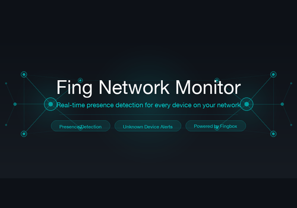

# Fing Network Monitor for Homey

A Homey app that turns your **Fingbox** into a powerful presence-detection and
network-security hub. Tracks every device on your network in real time, fires
flows when devices come and go, and alerts you the moment an unknown device
appears.

## Features

- 🏠 **Per-device presence detection** — Add any device tracked by Fing as a
  Homey device. Use its presence in flows: turn on lights when your phone
  arrives, arm the alarm when everyone has left, log the kids' arrival home.
- 🚨 **Unknown-device alerts** — Get notified the instant a device that
  isn't paired in Homey shows up on your network. Powers a flow trigger
  with the device's name, MAC address, and IP.
- 📡 **Continuous 24/7 polling** — Runs as a background service on your
  Homey Pro / Self-Hosted Server. Polls the Fing Local API every 30 seconds
  (configurable 10–300s).
- 🔐 **Local-only, no cloud** — Talks directly to your Fingbox on the local
  network. Your API key is stored in Homey's encrypted device store and is
  never sent anywhere else.
- 🎨 **Dynamic device icons** — The device tile icon swaps between a
  solid-filled house (present) and an outline house with an open door
  (away) depending on the device's current state.

## Requirements

- A **Fingbox** with Local API enabled (Fing app → Fingbox → Settings → Local API)
- **Homey Pro (Early 2023+)** or **Homey Self-Hosted Server** running firmware
  v13 or later

## Setup

1. Install the app from the Homey App Store
2. Open the app's settings page and enter:
   - Your Fingbox's IP address
   - Port (default `49090`)
   - Your Fing Local API key
3. Add the **Fingbox** device from the regular "Add a Device" flow
4. Add individual **Network Devices** from the same flow — you'll get a
   list of every device Fing has seen on your network

## Flows

### Trigger
- **An unknown device appeared on the network** — fires once per session for
  any device that is online but not yet paired in Homey. Tokens: device name,
  MAC address, IP address.

### Per-device (automatic, from `alarm_presence`)
- **A device came online**
- **A device went offline**

## Capabilities

**Fingbox card:**
- Connection Lost — alarm capability, true when the Fingbox is unreachable
- Online Devices — count of devices currently online

**Network Device card:**
- Status — Present / Away
- Away alarm — drives the red "away" indicator
- IP Address — current IP (updates on DHCP reassignment)
- Last Seen — timestamp of the most recent state change, in your local timezone

## Privacy & Security

- The Fing API key is collected once in the settings page, then immediately
  cleared from plain-text settings and stored in Homey's encrypted device store
- All traffic stays on your local network — no cloud relay, no telemetry
- The app only requires Local API access to your Fingbox; no other permissions

## License

MIT — see [LICENSE](LICENSE).

## Issues & contributions

Bug reports and pull requests welcome at
<https://github.com/fredhill/homey-fing-network>.
